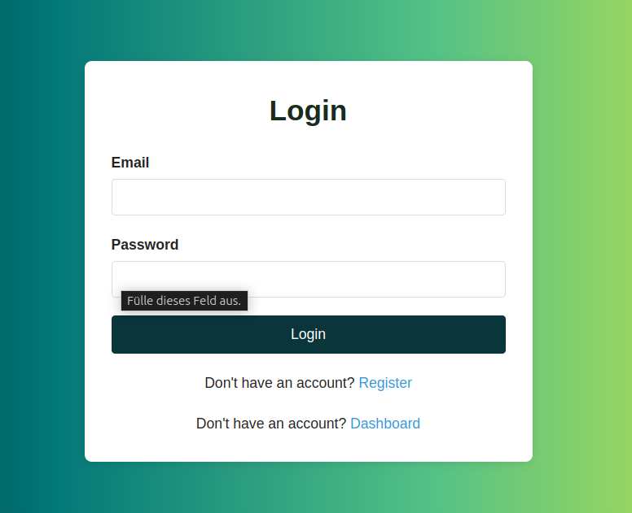

    

<!-- 
  <h3 align="center"><a href="">Fullstack-Demo-App</a></h3> -->

# fullstack-demo-app

in progress ...

ToDo:

- Message if Mail is not correct - done (Login.jsx & server.js)
- Message if Password is not correct - done (Login.jsx & server.js)
- "Welcome"-Message: Name is missing - done (Dashboard.jsx)
- correct text to dashboard - done (Dashboard.jsx)
- Upload a picture and safe it in our API

Design-Tools:
- https://cssgradient.io/